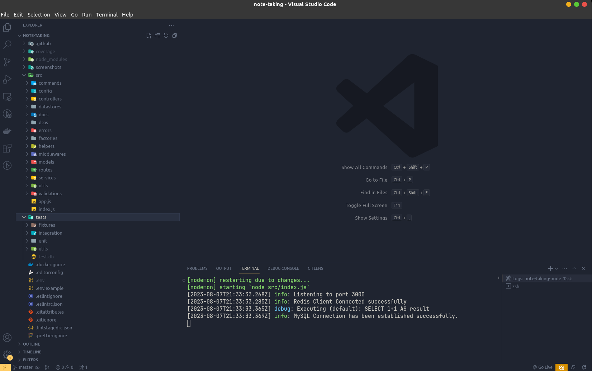
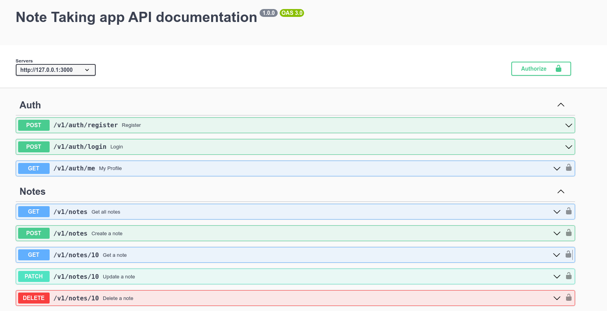
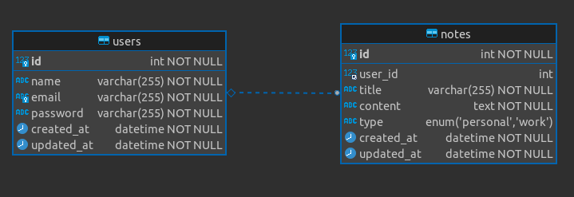
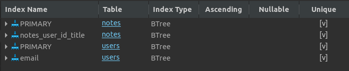
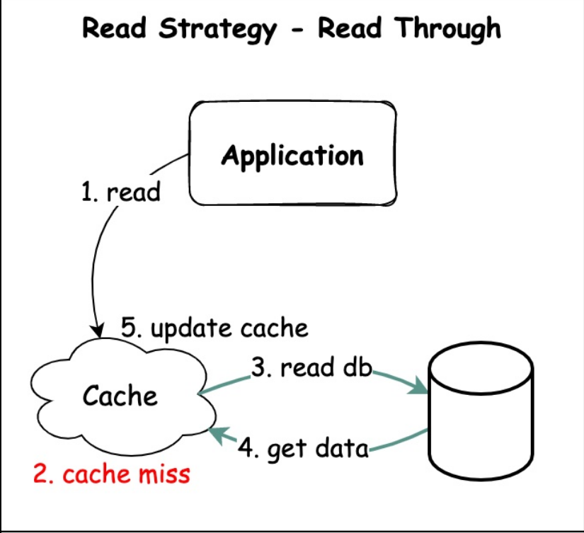
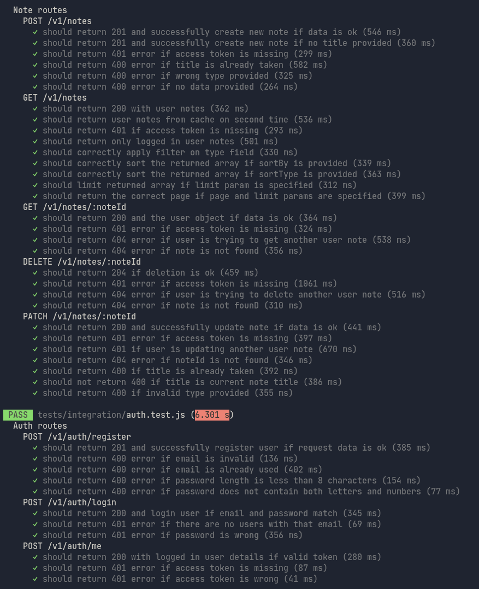
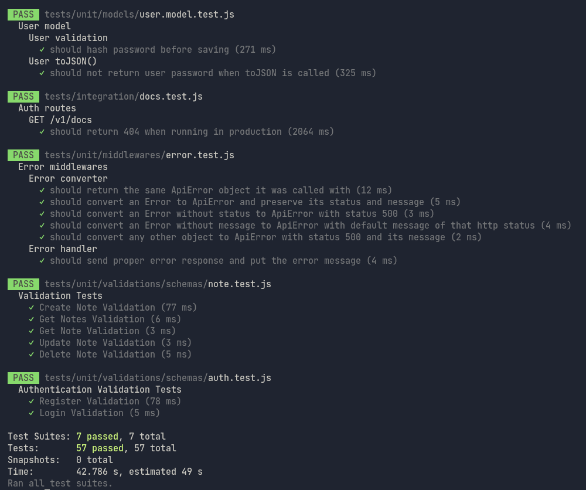
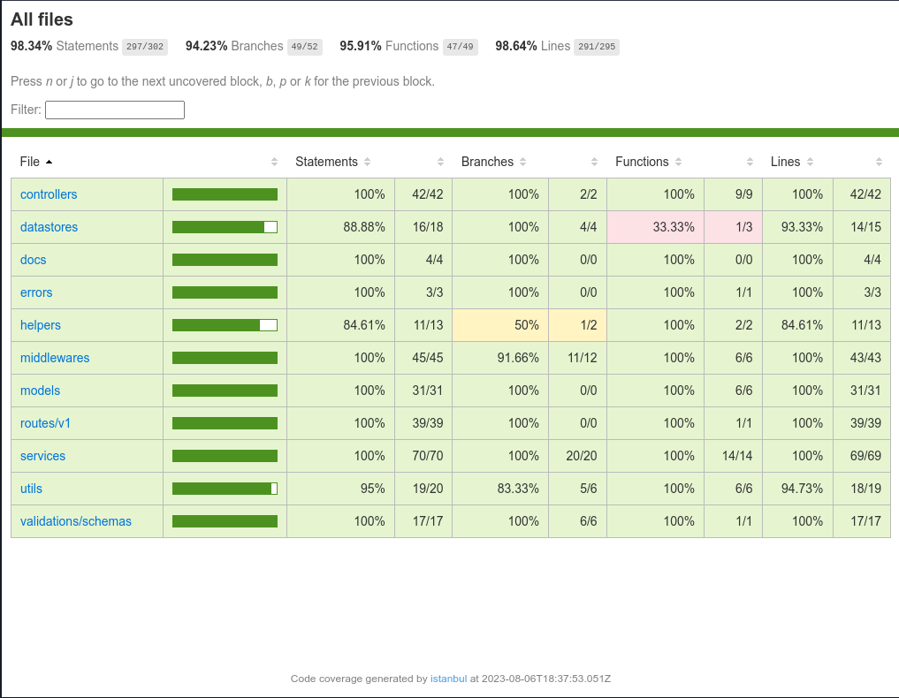
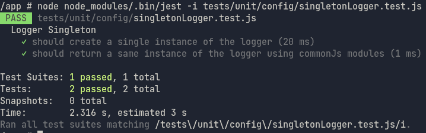

<p align="center">
  
  <h3 align="center">Note Taking API</h3>
</p>

## Usage with docker

1. Clone the repo

   ```sh
   git clone git@github.com:civilcoder55/note-taking-app.git
   ```

   or

   ```sh
   git clone https://github.com/civilcoder55/note-taking-app.git
   ```

2. Change directory

   ```sh
   cd note-taking-app
   ```

3. update the env file with proper
   Leave it if you want, default values should work

   ```sh
   cp .env.example .env
   ```

4. Build images and run containers

   ```sh
   docker-compose up -d
   ```

5. wait some time until mysql booting then Create and Sync database

   ```sh
   sleep 3 && docker exec -it note-taking-node npm run db:sync
   ```

6. Access API at

   ```sh
   http://localhost:3000/v1/docs
   ```

7. Access docker logs

   ```sh
   docker logs -f note-taking-node
   ```

8. To run test
   ```sh
   docker exec -it note-taking-node npm run test
   ```

## Usage without docker

1. Clone the repo

   ```sh
   git clone git@github.com:civilcoder55/note-taking-app.git
   ```

   or

   ```sh
   git clone https://github.com/civilcoder55/note-taking-app.git
   ```

2. Make sure you have MySQL database and Redis server installed

3. Change directory

   ```sh
   cd note-taking-app
   ```

4. Update the env file with proper variables

   ```sh
   cp .env.example .env
   ```

5. Install npm dependencies

   ```sh
   npm install
   ```

6. create and Sync database

   ```sh
   npm run db:sync
   ```

7. To run tests

   ```sh
   npm run test
   ```

8. To run app

   ```sh
   npm start
   ```

9. Access API at

   ```sh
   http://localhost:3000/v1/docs
   ```

## API Documentations and Collections

- You can access swagger API docs at http://localhost:3000/v1/docs
- or you can use the Postman collection which includes all the different response examples

* Click on the image to download the collection

[](https://raw.githubusercontent.com/civilcoder55/note-taking/master/src/docs/NoteTaking.postman_collection.json)

## screens

<p align="center">
  
</p>

<p align="center">
  
</p>

## Break down the task requirements

#### ORM :

- used Sequlize orm with MySQL database.
- defined two models for Note and User.
- used sync to migrate and update the status of database tables and schema, I could used migration files as best practice to
  keep the state of the database changes but for simplicity I went for the sync command

---

#### database schema :

- users table with id as primary key and a unique index on emails
- notes table with id primary key and user_id as foreign key and unique composite index on (user_id, title)

<h3 align="center">ERD</h3>
<p align="center">
  
</p>

<h3 align="center">Indexes</h3>
<p align="center">
  
</p>

---

#### for API endpoints :

- implemented the following

##### Auth Endpoints

| Method | URL                 | Description                    |
| ------ | ------------------- | ------------------------------ |
| `GET`  | `/v1/auth/me`       | Retrieve logged in user data.  |
| `POST` | `/v1/auth/login`    | Login with email and password. |
| `POST` | `/v1/auth/register` | Register as new user.          |

##### Notes Endpoints

| Method   | URL             | Description               |
| -------- | --------------- | ------------------------- |
| `GET`    | `/v1/notes`     | Retrieve all user notes.  |
| `GET`    | `/v1/notes/:id` | Retrieve user note by id. |
| `POST`   | `/v1/notes`     | Create a new note.        |
| `PATCH`  | `/v1/notes/:id` | Update a note.            |
| `DELETE` | `/v1/notes/:id` | Delete a note.            |

---

#### Caching

- used Redis to cache most accessed notes
- used read through strategy
   <p align="center">
    
  </p>

  > In a real-world scenario, I will handle cache in more smart ways, like adding expiring time
  > or setting max memory for say 100 mb and set evection policy allkeys_lru to delete lease recently used notes

---

#### Authentication

- used JWT simple tokens with an expiration time, to handle authentication in a stateless manner
  > In a real-world scenario, I will go for short_life access tokens and long_life refresh tokens, for example, using passport lib, it's more secure and standarized
- For logout, I didn't implement it as it is not part of the assessment scope
  > In real world scenario I will handle it by invoking the token either by keeping its state in the database and checking for existence on validate or remove it on logout
  > If I need to keep it stateless and don't keep track of tokens, all I need to do is store only blacklisted tokens,
  > When validating check if not blacklisted and when logout add a token to the blacklist store (redis for example)

---

#### Validation

- Used Joi lib to define validation schemas
- Defined a validator middleware to validate schemas against request body, params, and queries

---

#### Dockerizing the application

- I create a Dockerfile for the application's main image, it is a node image with installed npm dependencies and application data
- used Redis' latest official image
- used MySQL's latest official image
- Create a docker-compose file for the stack to run 1 container of each image, two named volumes for datastores data,
  one bridge network for all stack

---

#### Unit tests

- I used Jest to write unit and integration tests

<h3 align="center">Tests</h3>
<p align="center">
  
</p>

<p align="center">
  
</p>

- you can see coverage report at coverage/index.html after running

  ```sh
    npm run coverage
  ```

  or

  ```sh
   docker exec -it note-taking-node npm run test
  ```

  <p align="center">
    
  </p>

#### CI/CD

- I used GitHub actions to write a simple ci pipeline to ensure code linting and pass tests
- I didn't write a cd pipeline, I couldn't find the proper environment or server to deploy (free Heroku Dynos are gone 😭)

---

#### Design patterns

- singleton pattern

  - Node modules by default implement a singleton pattern, it caches the module on the first import/require then uses the same instance on every upcoming import/require https://nodejs.org/api/modules.html#caching

  - So we don't actually need to apply this pattern for say logger but let's rebuild it to implement the actual pattern I rebuilt it (but not used) in src/config/singletonLogger.js and covered both singleton and commonJs modules with two test cases

  <p align="center">
  
  </p>

- Factory method pattern https://github.com/civilcoder55/note-taking-app/commit/f7e7a833fb0510d6077392a63850ab863a61bc7d
  - I didn't find a need to do the factory method but I made some edits to make a proof of concept of the pattern
  - First, i added two new columns to the notes table to distinguish between work and personal notes
  - then added data object classes for each work and personal that both inherit from note to extend shared behavior
  - then added note factory to return the correct dto based on the type
  - then consumed this factory in the note create and update service to return correct data based on note type before persisting it on the database

---

## Built With

- Node (v20.5)
- Express (4.17)
- MySQL (8.0)
- Redis (7.0)

## todo

- [x] Read and analyze task doc
- [x] boilerplate and init new express app and setup initial configs
- [x] dockerize application stack
- [x] setup mysql database
- [x] create database models and sync them
- [x] add logger
- [x] create users register/login API endpoints
- [x] Create user notes API endpoints
- [x] add caching for notes endpoint
- [x] Add swagger and postman documentation
- [x] Write unit and integration tests using jest
- [x] add a singleton design pattern
- [x] add factory design pattern
- [x] optimize and refactor the code
- [x] create CI pipeline using GitHub actions
- [x] finalize readme file
